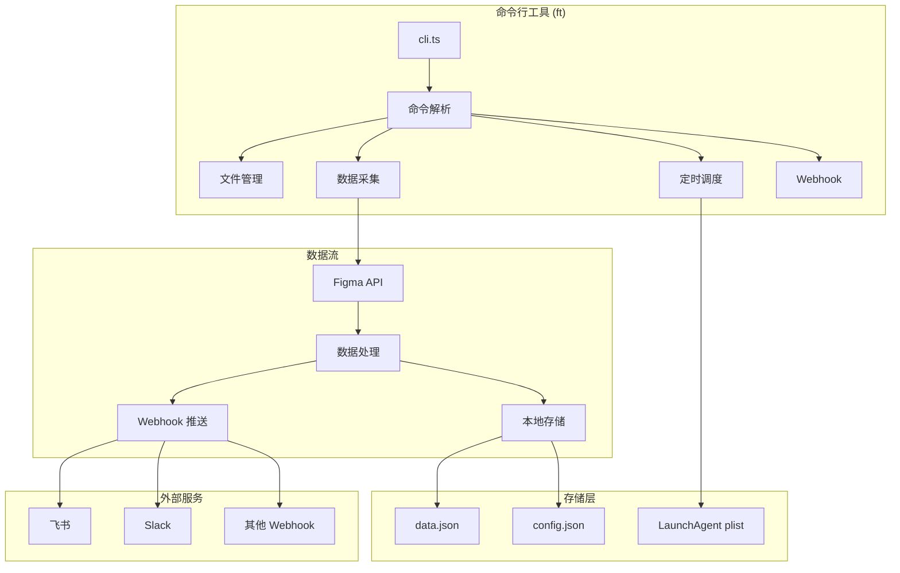

# FigmaTrack JS 项目文档

> **Figma Community Stats Tracker** - 追踪您的 Figma 社区文件统计数据

[](https://github.com/cyrus-cai/figmatrackjs)
[](LICENSE)
[](https://bun.sh/)

---

## 📖 目录

1. [项目概述](#项目概述)
2. [核心功能](#核心功能)
3. [技术架构](#技术架构)
4. [安装指南](#安装指南)
5. [使用说明](#使用说明)
6. [API 参考](#api-参考)
7. [数据结构](#数据结构)
8. [配置文件](#配置文件)
9. [定时任务](#定时任务)
10. [Webhook 集成](#webhook-集成)
11. [开发指南](#开发指南)
12. [故障排除](#故障排除)

---

## 项目概述

FigmaTrack JS 是一个基于 Bun 运行时的命令行工具，用于追踪 Figma 社区文件的统计数据（用户数和点赞数）。它支持定时采集并通过 Webhook 发送通知到您指定的接收端（如飞书、Slack 等）。

### 主要特性

- 🔄 **自动追踪** - 定时采集 Figma 社区文件的用户数和点赞数
- 📊 **数据对比** - 自动计算并显示与上次采集的数据变化
- 🔔 **Webhook 通知** - 支持多个 Webhook 端点同时推送
- ⏰ **灵活调度** - 支持多个时间点的定时任务
- 💾 **本地存储** - 所有数据本地保存，支持历史记录查询

---

## 核心功能

### 1. 文件管理

| 命令 | 描述 |
|------|------|
| `ft --add <URL\|ID>` | 添加 Figma 社区文件进行追踪 |
| `ft --remove` | 交互式移除已追踪的文件 |
| `ft --list` | 列出所有正在追踪的文件 |

### 2. 数据采集

| 命令 | 描述 |
|------|------|
| `ft --run` | 立即执行一次数据采集 |

### 3. 定时调度

| 命令 | 描述 |
|------|------|
| `ft --schedule add <HH:MM>` | 添加定时任务（支持多个时间点） |
| `ft --schedule remove` | 移除定时任务 |
| `ft --schedule list` | 查看当前定时任务状态 |

### 4. Webhook 管理

| 命令 | 描述 |
|------|------|
| `ft --webhook add <URL>` | 添加 Webhook 接收地址 |
| `ft --webhook remove` | 移除 Webhook 地址 |
| `ft --webhook list` | 列出所有 Webhook 地址 |

---

## 技术架构



### 技术栈

| 组件 | 技术 |
|------|------|
| **运行时** | [Bun](https://bun.sh/) v1.0+ |
| **语言** | TypeScript |
| **定时任务** | macOS LaunchAgent / Linux Cron |
| **数据存储** | JSON 文件 |
| **HTTP 客户端** | Bun 内置 fetch |

### 目录结构

```
figmatrackjs/
├── src/
│   └── cli.ts              # 主程序入口
├── dist/
│   └── cli.js              # 编译产物
├── install.sh              # 安装脚本
├── uninstall.sh            # 卸载脚本
├── package.json            # 项目配置
├── README.md               # 快速入门指南
├── DOCUMENTATION.md        # 完整文档（本文件）
└── bun.lock               # 依赖锁定文件
```

### 安装后目录结构

```
~/.figmatrack/              # 安装目录
├── src/                    # 源代码
├── dist/                   # 编译后的 CLI
├── data/                   # 数据存储目录
├── data.json               # 追踪文件数据
├── config.json             # 配置文件（Webhook 等）
├── auto-triggered-tracker.log  # 定时任务日志
└── uninstall.sh            # 卸载脚本

~/.local/bin/ft             # CLI 命令软链接

~/Library/LaunchAgents/
└── com.tracker.figma.plist # macOS 定时任务配置
```

---

## 安装指南

### 方式一：一键安装（推荐）

```bash
curl -fsSL https://raw.githubusercontent.com/cyrus-cai/figmatrackjs/main/install.sh | bash
```

这将自动完成以下操作：
1. 检测并安装 Bun（如果未安装）
2. 下载 FigmaTrack 到 `~/.figmatrack`
3. 编译 TypeScript 源码
4. 创建 `ft` 命令
5. 配置 PATH 环境变量

### 方式二：手动安装

```bash
# 克隆仓库
git clone https://github.com/cyrus-cai/figmatrackjs.git
cd figmatrackjs

# 安装依赖并编译
bun install && bun run build

# 运行安装脚本
./install.sh
```

### 验证安装

```bash
# 重新加载 shell 配置
source ~/.zshrc  # 或 source ~/.bashrc

# 验证命令可用
ft --help
```

### 卸载

```bash
~/.figmatrack/uninstall.sh
```

---

## 使用说明

### 快速开始

```bash
# 1. 添加要追踪的 Figma 文件
ft --add https://www.figma.com/community/file/123456789

# 2. 配置 Webhook 接收通知
ft --webhook add https://open.feishu.cn/open-apis/bot/v2/hook/xxxxx

# 3. 设置定时任务（每天 9:00 和 21:00 采集）
ft --schedule add 09:00 21:00

# 4. 手动执行一次测试
ft --run
```

### 详细用法

#### 添加文件

```bash
# 通过 URL 添加
ft --add https://www.figma.com/community/file/123456789

# 通过 ID 添加
ft --add 123456789

# 批量添加（空格或逗号分隔）
ft --add 123456789 987654321
ft --add 123456789,987654321
```

> ⚠️ **注意**：追踪超过 5 个文件可能会因 Figma API 限制导致请求失败，系统会提示确认。

#### 移除文件

```bash
# 交互式移除
ft --remove

# 输出示例：
# Current files:
#   1. [123456789] My Design File
#   2. [987654321] Another File
#   0. Remove all
#
# Enter number(s) to remove (comma-separated, or 0 for all): 1
```

#### 定时任务

```bash
# 添加单个时间点
ft --schedule add 09:00

# 添加多个时间点
ft --schedule add 09:00 12:00 18:00 21:00

# 查看当前调度
ft --schedule list

# 移除调度（交互式）
ft --schedule remove
```

> ⚠️ **注意**：如果两个时间点间隔小于 10 分钟，可能因 Figma API 速率限制导致请求失败。

#### Webhook 配置

```bash
# 添加 Webhook
ft --webhook add https://open.feishu.cn/open-apis/bot/v2/hook/xxxxx

# 添加多个 Webhook
ft --webhook add https://webhook1.com https://webhook2.com

# 查看所有 Webhook
ft --webhook list

# 移除 Webhook（交互式）
ft --webhook remove
```

---

## API 参考

### Figma API

FigmaTrack 使用以下 Figma API 端点获取社区文件统计数据：

```
GET https://www.figma.com/api/resources/hub_files/{fileId}?include_full_category=true
```

#### 请求头

```typescript
{
  "User-Agent": "Mozilla/5.0 (Macintosh; Intel Mac OS X 10_15_7)...",
  "Accept": "application/json, text/plain, */*",
  "Accept-Language": "en-US,en;q=0.9",
  "Referer": "https://www.figma.com/",
  "Origin": "https://www.figma.com"
}
```

#### 响应数据（关键字段）

```typescript
{
  "meta": {
    "resource": {
      "name": string,       // 文件名称
      "user_count": number, // 用户数
      "like_count": number  // 点赞数
    }
  }
}
```

### Webhook 接口

FigmaTrack 发送的 Webhook 消息格式（兼容飞书机器人）：

```typescript
{
  "msg_type": "text",
  "content": {
    "text": "[文件名称]\n     users:12345 (+23)\n     likes:678 (+5)\n     vs 12/05 09:00"
  }
}
```

---

## 数据结构

### data.json

存储所有追踪文件及其历史记录：

```typescript
interface Data {
  [fileId: string]: {
    name: string;           // 文件名称
    records: Array<{
      date: string;         // 日期 (YYYY-MM-DD)
      timestamp?: string;   // 时间戳 (YYYY/MM/DD HH:MM:SS)
      user_count: number;   // 用户数
      like_count: number;   // 点赞数
    }>;
  };
}
```

**示例：**

```json
{
  "123456789": {
    "name": "My Awesome Design",
    "records": [
      {
        "date": "2025-12-18",
        "timestamp": "2025/12/18 09:00:15",
        "user_count": 12345,
        "like_count": 678
      }
    ]
  }
}
```

### config.json

存储应用配置：

```typescript
interface Config {
  webhook_urls?: string[];  // Webhook 地址列表
}
```

**示例：**

```json
{
  "webhook_urls": [
    "https://open.feishu.cn/open-apis/bot/v2/hook/xxxxx",
    "https://hooks.slack.com/services/xxx/xxx/xxx"
  ]
}
```

---

## 配置文件

### 文件路径

| 配置 | 路径 |
|------|------|
| 数据文件 | `~/.figmatrack/data.json` |
| 配置文件 | `~/.figmatrack/config.json` |
| 日志文件 | `~/.figmatrack/auto-triggered-tracker.log` |
| 定时任务 | `~/Library/LaunchAgents/com.tracker.figma.plist` |

### 环境变量

FigmaTrack 不需要配置环境变量，所有配置通过 CLI 命令或配置文件管理。

---

## 定时任务

### macOS (LaunchAgent)

FigmaTrack 使用 macOS 的 LaunchAgent 实现定时任务，配置文件位于：

```
~/Library/LaunchAgents/com.tracker.figma.plist
```

#### 配置示例

```xml
<?xml version="1.0" encoding="UTF-8"?>
<!DOCTYPE plist PUBLIC "-//Apple//DTD PLIST 1.0//EN" "...">
<plist version="1.0">
<dict>
    <key>Label</key>
    <string>com.tracker.figma</string>
    <key>ProgramArguments</key>
    <array>
        <string>/path/to/bun</string>
        <string>~/.figmatrack/dist/cli.js</string>
        <string>--run</string>
    </array>
    <key>StartCalendarInterval</key>
    <array>
        <dict>
            <key>Hour</key>
            <integer>9</integer>
            <key>Minute</key>
            <integer>0</integer>
        </dict>
        <dict>
            <key>Hour</key>
            <integer>21</integer>
            <key>Minute</key>
            <integer>0</integer>
        </dict>
    </array>
    <key>StandardOutPath</key>
    <string>~/.figmatrack/auto-triggered-tracker.log</string>
    <key>StandardErrorPath</key>
    <string>~/.figmatrack/auto-triggered-tracker.log</string>
</dict>
</plist>
```

#### 管理命令

```bash
# 手动加载任务
launchctl load ~/Library/LaunchAgents/com.tracker.figma.plist

# 手动卸载任务
launchctl unload ~/Library/LaunchAgents/com.tracker.figma.plist

# 查看任务状态
launchctl list | grep com.tracker.figma
```

### Linux (Cron)

Linux 系统需要手动配置 crontab：

```bash
# 编辑 crontab
crontab -e

# 添加定时任务（每天 9:00 和 21:00）
0 9 * * * /path/to/bun ~/.figmatrack/dist/cli.js --run >> ~/.figmatrack/auto-triggered-tracker.log 2>&1
0 21 * * * /path/to/bun ~/.figmatrack/dist/cli.js --run >> ~/.figmatrack/auto-triggered-tracker.log 2>&1
```

---

## Webhook 集成

### 飞书

1. 在飞书群聊中添加自定义机器人
2. 复制 Webhook 地址
3. 配置到 FigmaTrack：

```bash
ft --webhook add https://open.feishu.cn/open-apis/bot/v2/hook/xxxxx
```

### Slack

1. 创建 Slack Incoming Webhook
2. 复制 Webhook URL
3. 配置到 FigmaTrack：

```bash
ft --webhook add https://hooks.slack.com/services/xxx/xxx/xxx
```

> **注意**：Slack Webhook 需要不同的消息格式，当前版本使用飞书格式。如需 Slack 支持，请提交 Issue。

### 自定义 Webhook

任何支持 POST JSON 请求的服务都可以接收通知：

```typescript
// 请求体格式
{
  "msg_type": "text",
  "content": {
    "text": "消息内容"
  }
}
```

---

## 开发指南

### 环境准备

```bash
# 安装 Bun
curl -fsSL https://bun.sh/install | bash

# 克隆项目
git clone https://github.com/cyrus-cai/figmatrackjs.git
cd figmatrackjs

# 安装依赖
bun install
```

### 开发命令

```bash
# 直接运行（开发模式）
bun run dev

# 或直接执行
bun run src/cli.ts --help

# 编译
bun run build  # 输出到 dist/cli.js
```

### 代码结构

`src/cli.ts` 是唯一的源文件，包含以下主要部分：

| 行号范围 | 功能模块 |
|---------|---------|
| 1-30 | 配置常量和导入 |
| 37-70 | 配置管理（loadConfig, saveConfig） |
| 72-103 | 类型定义 |
| 104-260 | 核心函数（fetchStats, calcDiff, buildMessage） |
| 261-400 | 文件管理命令（cmdAdd, cmdRemove, cmdList） |
| 402-445 | 运行命令（cmdRun） |
| 447-760 | 定时任务管理（cmdSchedule, cmdUnschedule） |
| 762-905 | Webhook 管理（cmdWebhook） |
| 907-1100 | UI 输出（printBox, printHelp） |
| 1111-1211 | CLI 入口和参数解析 |

### 添加新功能

1. 在 `src/cli.ts` 中添加命令处理函数：

```typescript
async function cmdMyFeature(): Promise<void> {
  // 实现功能
}
```

2. 在参数解析部分添加新选项：

```typescript
const { values, positionals } = parseArgs({
  args: filteredArgs,
  options: {
    // ... 其他选项
    myfeature: { type: "boolean" },
  },
  allowPositionals: true
});
```

3. 添加命令分发逻辑：

```typescript
} else if (values.myfeature) {
  await cmdMyFeature();
}
```

---

## 故障排除

### 常见问题

#### 1. `ft` 命令未找到

```bash
# 重新加载 shell 配置
source ~/.zshrc  # 或 source ~/.bashrc

# 检查 PATH
echo $PATH | grep ".local/bin"

# 手动添加到 PATH
export PATH="$HOME/.local/bin:$PATH"
```

#### 2. Bun 未找到

```bash
# 安装 Bun
curl -fsSL https://bun.sh/install | bash

# 加载 Bun 环境
source ~/.zshrc
```

#### 3. 定时任务未执行

```bash
# 检查 LaunchAgent 状态
launchctl list | grep com.tracker.figma

# 查看日志
cat ~/.figmatrack/auto-triggered-tracker.log

# 重新加载任务
launchctl unload ~/Library/LaunchAgents/com.tracker.figma.plist
launchctl load ~/Library/LaunchAgents/com.tracker.figma.plist
```

#### 4. Figma API 请求失败

- 检查网络连接
- 确认文件 ID 正确
- 减少追踪文件数量（建议 ≤5 个）
- 增加定时任务间隔（建议 ≥10 分钟）

#### 5. Webhook 推送失败

```bash
# 测试 Webhook
curl -X POST \
  -H "Content-Type: application/json" \
  -d '{"msg_type":"text","content":{"text":"测试消息"}}' \
  "您的Webhook地址"
```

### 日志位置

| 类型 | 路径 |
|------|------|
| 定时任务日志 | `~/.figmatrack/auto-triggered-tracker.log` |

### 重置配置

```bash
# 删除所有数据重新开始
rm -rf ~/.figmatrack/data.json ~/.figmatrack/config.json

# 完全重装
~/.figmatrack/uninstall.sh
curl -fsSL https://raw.githubusercontent.com/cyrus-cai/figmatrackjs/main/install.sh | bash
```

---

## 更新日志

### v0.1.12 (当前版本)

- 支持多个 Webhook 端点
- 支持多个定时任务时间点
- 改进的 CLI 帮助界面
- 交互式文件和 Webhook 管理

---

## 许可证

MIT License - 详见 [LICENSE](LICENSE) 文件

## 贡献

欢迎提交 Issue 和 Pull Request！

- GitHub: [https://github.com/cyrus-cai/figmatrackjs](https://github.com/cyrus-cai/figmatrackjs)
- 问题反馈: [https://github.com/cyrus-cai/figmatrackjs/issues](https://github.com/cyrus-cai/figmatrackjs/issues)
